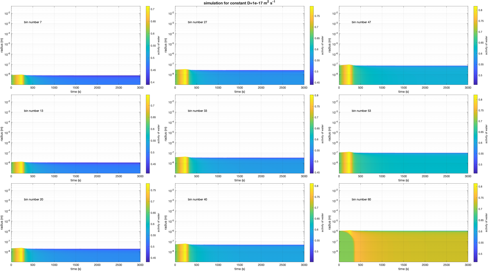
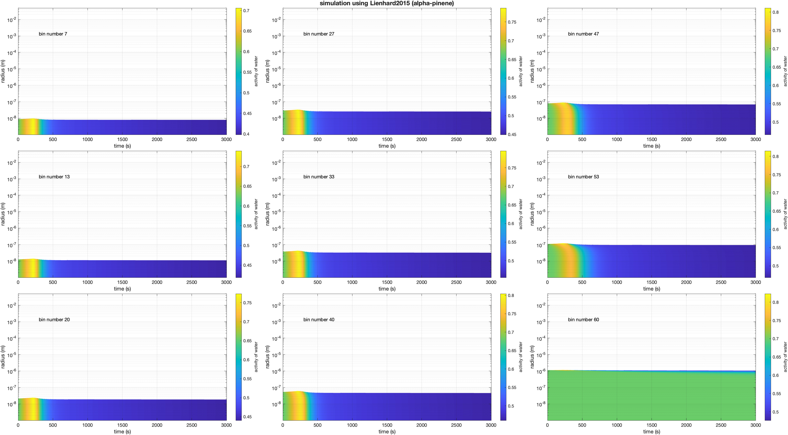
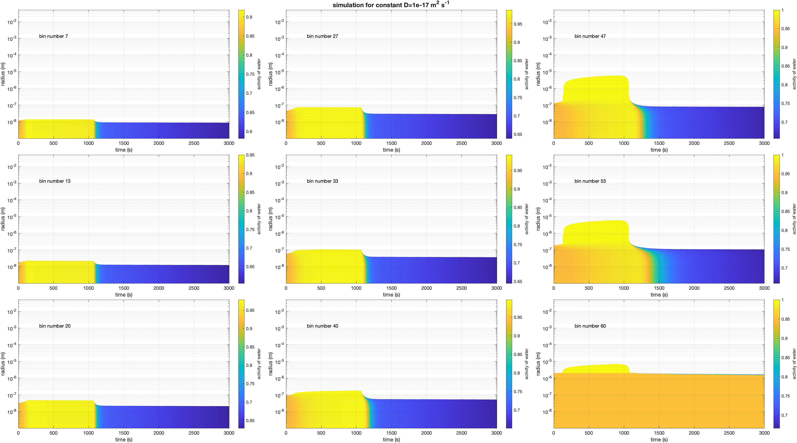

# Bin Diffusion Model (BDM)

BDM couples the Bin Microphysics Model (BMM) to the moving-boundary radial diffusion model (MBD).  BMM supplies the parcel thermodynamics, aerosol/droplet size distribution and condensational growth, while BDM resolves the radial water/solute concentration profile inside each representative liquid particle.

The `bmm/` directory is a subtree.  BDM deliberately supports only a restricted subset of BMM physics; BDM-specific coupling should therefore be implemented in the top-level BDM code rather than by modifying BMM itself.

## Supported BMM configuration

The current BDM coupling is designed for:

- **full-moving bins** (`bin_scheme_flag = 0`);
- **no stochastic collection / aggregation** (`sce_flag = 0`);
- **one soluble aerosol component** (`n_comps = 1`);
- **no semivolatile aerosol treatment** (`sv_flag = 0`);
- **molecular Koehler treatment** (`kappa_flag = 0`), consistent with the radial water-activity calculation;
- **homogeneous ice nucleation only**, using Koop (`ice_nucleation_mech = .true., .false., .false., .false.`);
- **no INP classes** (`n_inp_classes = 0`);
- **no entrainment or aerosol exchange**;
- **no secondary-ice or breakup mechanisms**.

`read_in_bdm_namelist` checks these restrictions at startup.  Unsupported combinations stop with an explanatory error rather than running with inconsistent BDM/BMM state.

These restrictions are physical as well as numerical.  A BDM liquid bin has an associated internal radial concentration profile.  Full-moving condensational growth preserves the identity of that representative particle.  Aggregation, fixed-grid remapping and entrainment would require an additional rule for merging/remapping/diluting those internal radial profiles, which is not presently defined.

## Coupling to the current BMM

The current BMM interface is

```fortran
call bin_microphysics(func1, func2, func3, func4)
```

BDM calls it with

```fortran
call bin_microphysics(fparcelwarmdiff, fparcelcold, icenucleation, &
                      noncollisional_iceformation_diff)
```

`fparcelwarmdiff` is the BDM warm-cloud callback.  The active ice callback is `noncollisional_iceformation_diff`, which matches the current BMM `func4` interface.

For homogeneous freezing, BDM retains its special radial calculation.  In each radial shell it calculates water activity from the resolved water and soluble-material concentrations and evaluates the Koop homogeneous nucleation rate.  The resulting frozen number concentration is then transferred to the ice population using the same full-moving number, mass and moment bookkeeping as the current BMM non-collisional ice-formation routine.  Thus the **nucleation physics remains BDM-specific**, while the **ice-state bookkeeping follows current BMM**.

The BMM subtree itself is not modified for this coupling.

## Diffusion coefficient

The top-level `namelist.in` selects the diffusion treatment:

```fortran
diffusion_type = 0   ! constant diffusion coefficient from the MBD namelist
diffusion_type = 1   ! composition-dependent coefficient from DCC
```

For `diffusion_type = 0`, the constant coefficient is `nmd%d_coeff` in `mbd/namelist.in`.

For `diffusion_type = 1`, BDM uses `diffusion_coeff_file` (normally `namelist.diff_coeffs`) and the DCC parameterisation selected there.


## Example simulations

The examples below show the evolution of the resolved radial **water activity** in selected BMM size bins.  Radius is shown on a logarithmic scale and the colour field gives the water activity within the particle as a function of radius and time.

### 195 K — constant diffusion coefficient

This case uses a constant molecular diffusion coefficient of \(D = 1\times10^{-17}\ \mathrm{m^2\,s^{-1}}\).



### 195 K — Lienhard2015 alpha-pinene

This case uses the composition-dependent **Lienhard2015** diffusion-coefficient parameterisation for **alpha-pinene**.



### 243 K — constant diffusion coefficient

This case uses a constant molecular diffusion coefficient of \(D = 1\times10^{-17}\ \mathrm{m^2\,s^{-1}}\) at the warmer initial temperature of 243 K.



These examples illustrate the sensitivity of the internal water distribution and particle growth to both temperature and the treatment of condensed-phase diffusion.


## Scientific background and references

BDM follows the modelling approach developed by **Fowler, Connolly and Topping (2020)**, who coupled size-resolved cloud-parcel microphysics to a condensed-phase diffusion model in order to investigate how restricted water transport within ultra-viscous aerosol particles affects particle growth and homogeneous ice nucleation.  This is the primary scientific reference for the BDM approach described here.

The moving-boundary radial diffusion treatment is also closely related to **Fowler et al. (2018)**, which describes a concentric-shell aerosol model in which the outer particle radius moves as water is taken up or lost and diffusion is solved through the particle interior.

### References

- Fowler, K., Connolly, P., and Topping, D. (2020): *Modelling the effect of condensed-phase diffusion on the homogeneous nucleation of ice in ultra-viscous particles*, **Atmospheric Chemistry and Physics**, 20, 683–698. https://doi.org/10.5194/acp-20-683-2020
- Fowler, K., Connolly, P. J., Topping, D. O., and O'Meara, S. (2018): *Maxwell–Stefan diffusion: a framework for predicting condensed phase diffusion and phase separation in atmospheric aerosol*, **Atmospheric Chemistry and Physics**, 18, 1629–1642. https://doi.org/10.5194/acp-18-1629-2018

## Repository layout

- `bin_diffusion_model.f90` — BDM/BMM/MBD coupling, including the BDM-specific warm and ice callbacks.
- `namelist.in` — top-level BDM controls and paths to the component namelists.
- `namelist.diffusion` — BMM configuration used by BDM.
- `namelist.diff_coeffs` — DCC diffusion-coefficient configuration.
- `bmm/` — Bin Microphysics Model subtree.
- `mbd/` — moving-boundary radial diffusion subtree.
- `dcc/` — diffusion-coefficient model subtree.

## Compilation

A Fortran NetCDF installation is required.  Set the NetCDF include/library variables used by the top-level `Makefile` for your system, then build with

```bash
make
```

The current BMM has dependencies in its `sce/` and `opt/` directories.  The top-level BDM Makefile builds/links these because the BMM module references them, even though the supported BDM configuration sets `sce_flag = 0` and does not use aggregation.

For a clean rebuild after updating a subtree or module interface, use

```bash
make cleanall
make
```

## Running

Run BDM with a top-level namelist, for example

```bash
./main.exe namelist.in
```

The top-level namelist identifies the BMM, MBD and DCC namelists used for the run.

## Validation of this BMM update

The BDM coupling was compiled against the supplied current BMM with explicit interfaces and bounds/runtime checking enabled.  A short runtime-check integration also completed without callback or bounds errors.  That test used a local NetCDF stub because the development environment did not contain the NetCDF Fortran module, so NetCDF I/O itself was not validated by that test.

## Documentation

Doxygen documentation can be generated from the source with

```bash
doxygen fortran.dxg
```
